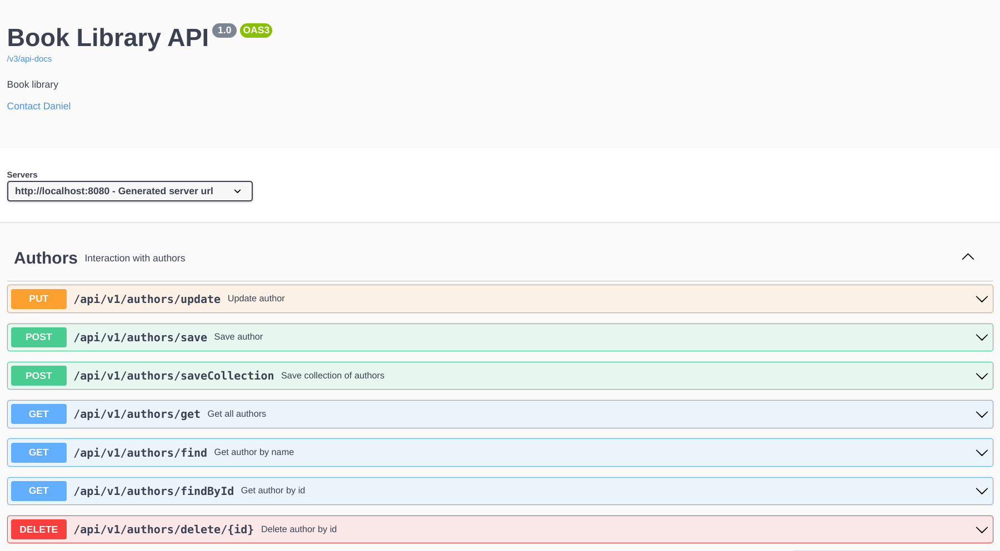
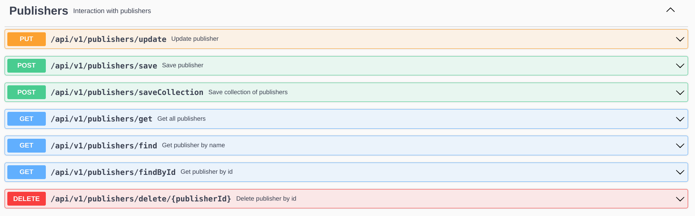
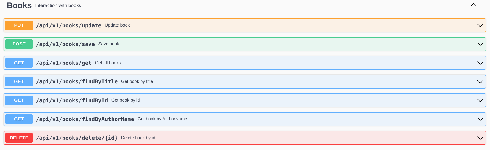

# Book Library Application

This application is a simple book library developed in Java using the Spring Boot Framework and Hibernate. It uses PostgreSQL as the database. It includes complex relationships between entities such as "one-to-many", "many-to-one", and "many-to-many". The application also uses caching to speed up data access.

## Description

The application allows you to manage a collection of books, authors, and publishers, including adding new books, authors, and publishers, editing existing ones, and deleting outdated entries. The implementation is based on the MVC (Model-View-Controller) architectural pattern, which provides a clear separation of business logic, presentation, and web request management. DTO (Data Transfer Object) objects are used to transfer data between layers. A cache service is used to speed up data access, which contains separate caches for each entity.

## Contents

- [Running the Application](#running-the-application)
- [Docker](#docker)
- [Environment Variables](#environment-variables)
- [Docker Compose](#docker-compose)
- [Swagger](#swagger)
- [Frontend Repository](#frontend-repository)
- [SonarCloud](#sonarcloud)
- [Developer Contacts](#developer-contacts)

## Running the Application

To run the application, you need to have Java and Maven installed on your machine. You can then clone the repository and run the application using the following commands:

```sh
git clone https://github.com/fozboom/book-library-java.git
cd booklibrary
mvn spring-boot:run
```

The application will start and be accessible at `http://localhost:8080`.

## Docker

This application can also be run using Docker. The Dockerfile is included in the repository. To build and run the Docker image, use the following commands:

```sh
docker build -t book_lib_backend .        
docker run -p 8080:8080 book_lib_backend
```

The application will start and be accessible at `http://localhost:8080`.

## Environment Variables

The application requires several environment variables to be set. These are defined in the `application.properties` file. Please ensure these are set in your environment before running the application.

## Docker Compose

The application can be run together with its frontend and database using Docker Compose. The `docker-compose.yml` file is included in the repository. The frontend code is located in a separate [repository](https://github.com/fozboom/book-library-ui) . To run the application with Docker Compose, use the following command:

```sh
docker-compose up
```

## Swagger

The application uses Swagger for API documentation. The Swagger UI can be accessed at `http://localhost:8080/swagger-ui.html` when the application is running.





## Frontend Repository

The frontend code for this application is located in a separate repository. You can find it [here](https://github.com/fozboom/book-library-ui).

## SonarCloud

[](https://sonarcloud.io/summary/new_code?id=fozboom_book-library-java) [](https://sonarcloud.io/summary/new_code?id=fozboom_book-library-java) [](https://sonarcloud.io/summary/new_code?id=fozboom_book-library-java) [](https://sonarcloud.io/summary/new_code?id=fozboom_book-library-java) [](https://sonarcloud.io/summary/new_code?id=fozboom_book-library-java) [](https://sonarcloud.io/summary/new_code?id=fozboom_book-library-java)

The application uses SonarCloud for continuous code quality inspection.

For a detailed code quality analysis, check the [SonarCloud report](https://sonarcloud.io/project/overview?id=fozboom_book-library-java).

## Developer Contacts

For any questions or suggestions, please contact the developer at <fozboom@gmail.com>.
